# ocphotos

A Memories-style photo experience for [OpenCloud](https://opencloud.eu): a date timeline,
"on this day", places, albums, tags, folders, a map and duplicates, with OpenCloud as the
source of truth for the files.

It is a **native OpenCloud web extension** (Vue 3 + extension-sdk, session-based, no iframe)
plus a **Go photo service** that keeps the metadata index (EXIF, GPS, tags, albums, hashes)
and generates thumbnails, including HEIC.

## Screenshots

| Timeline (justified, month/day headers, Rewind) | On this day |
|---|---|
| 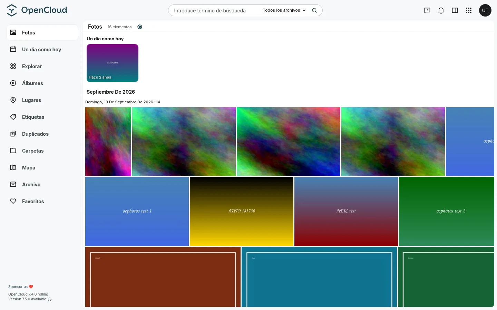 | 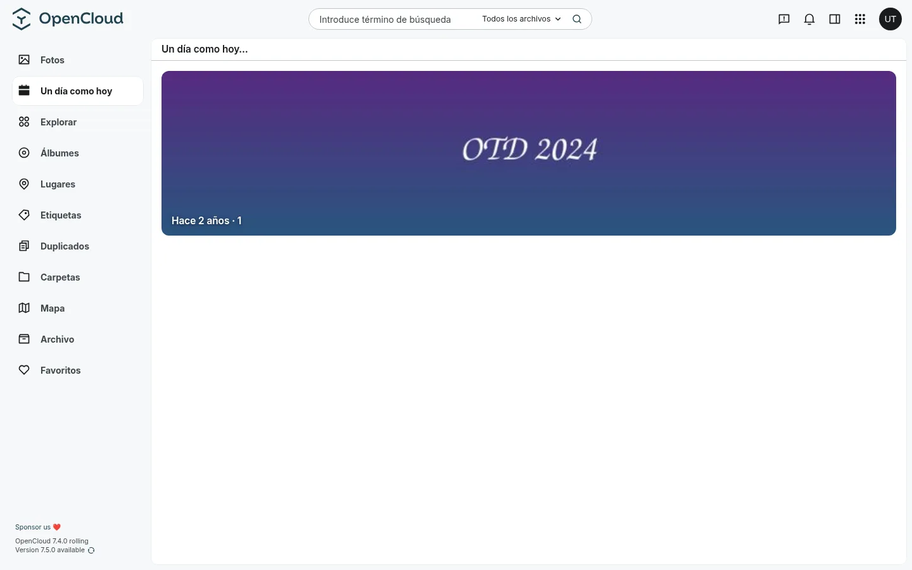 |

| Explore (search hub) | Albums |
|---|---|
| 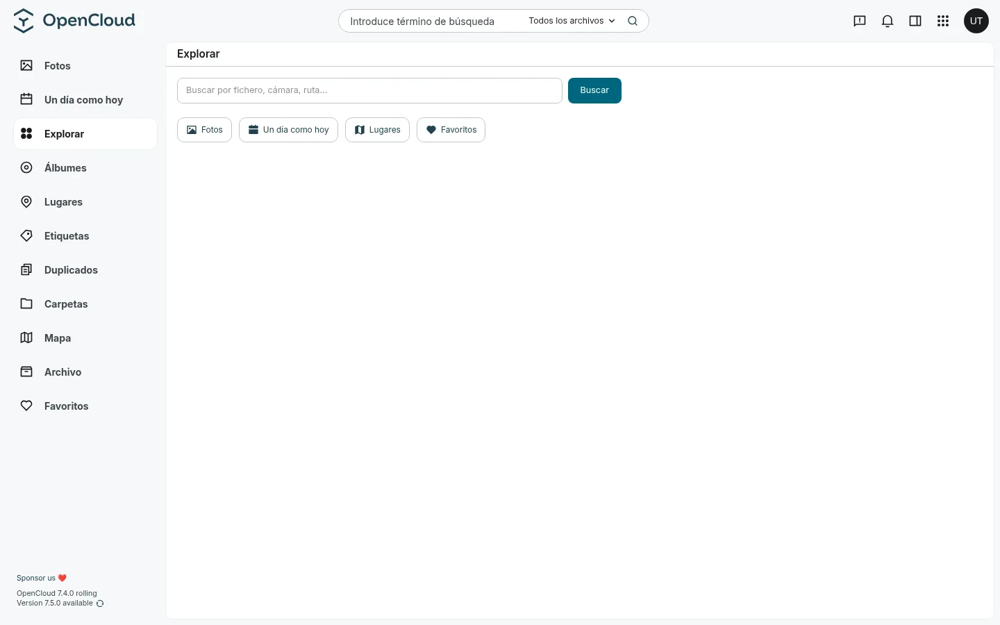 | 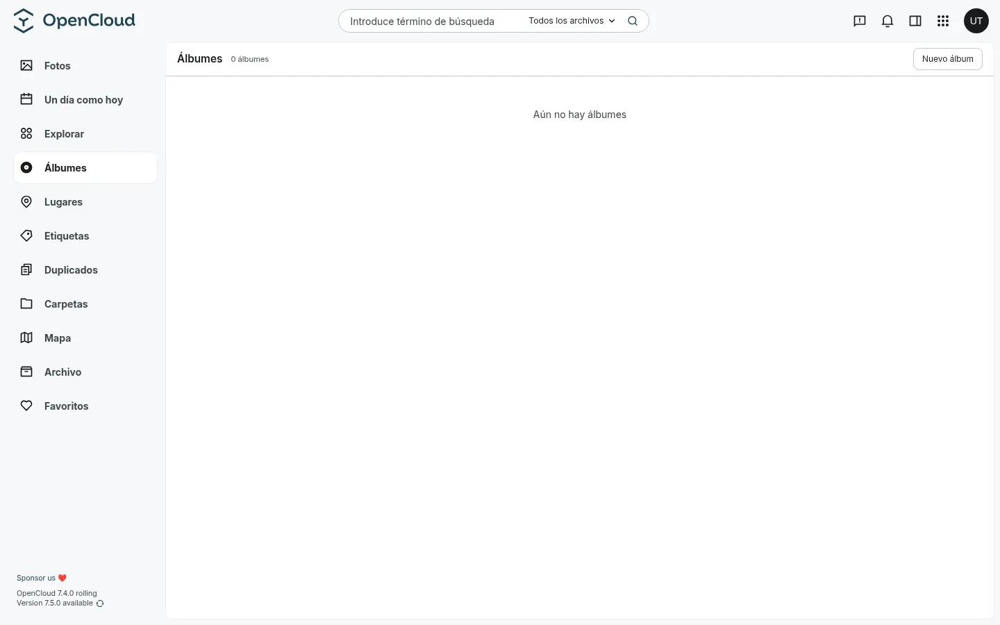 |

| Places (reverse geocoded) | Tags |
|---|---|
| 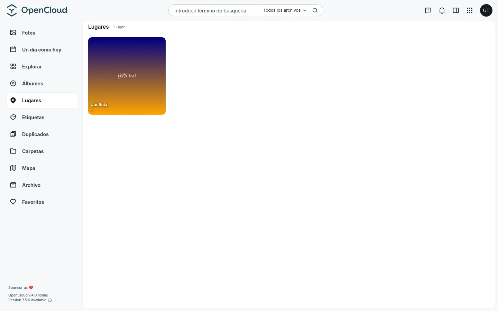 | 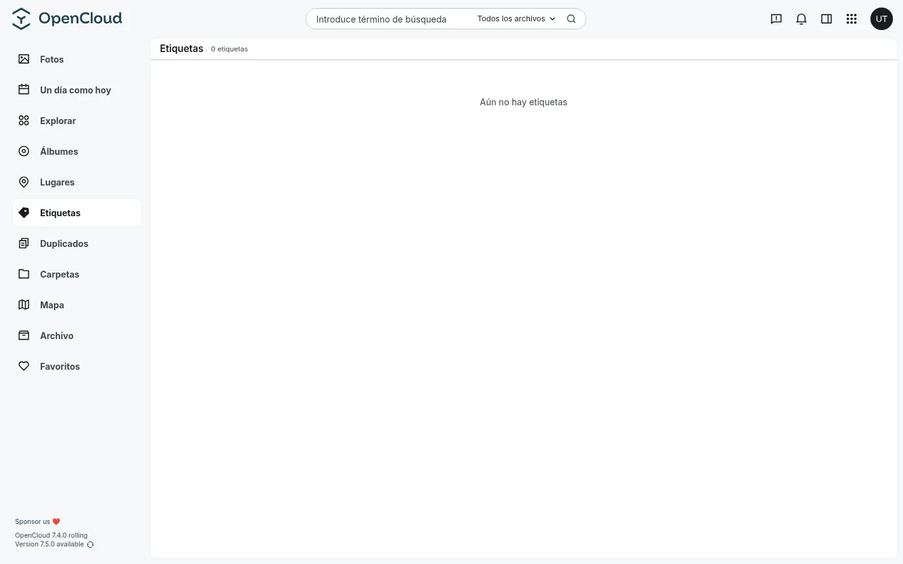 |

| Folders (OpenCloud tree) | Map (thumbnail markers) |
|---|---|
| 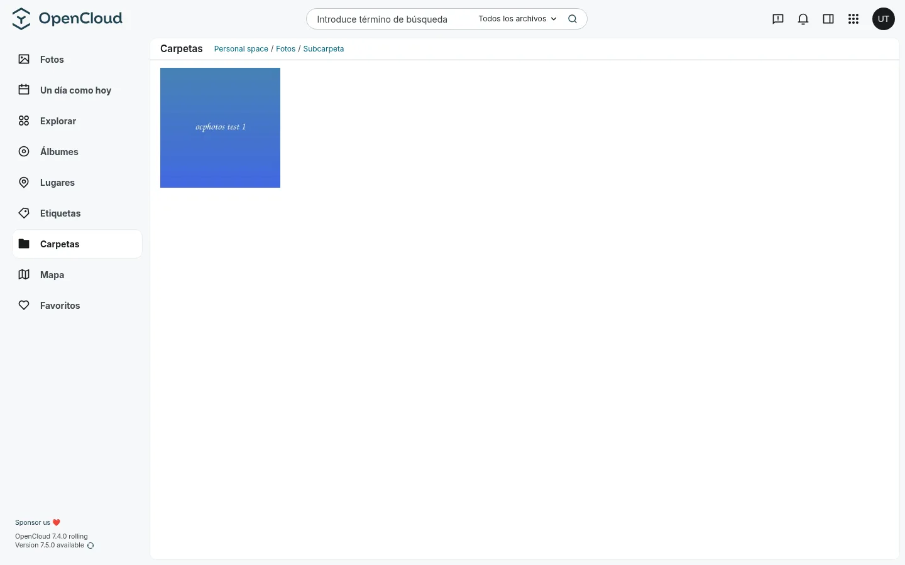 | 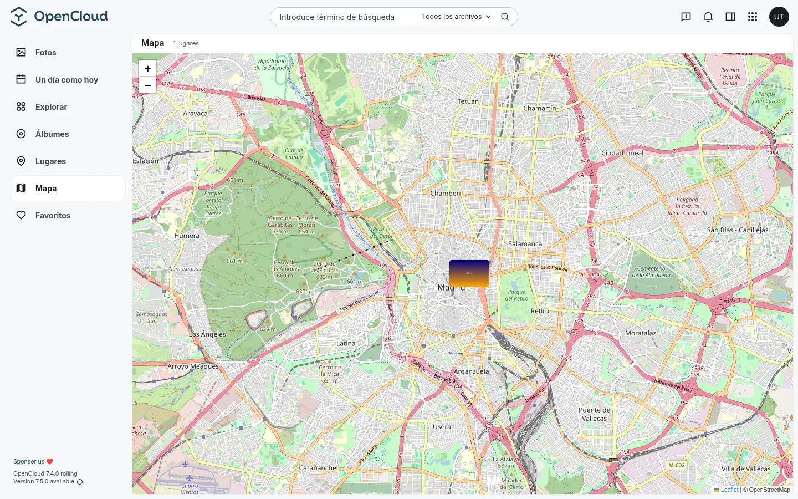 |

| Duplicates (perceptual hash) | Archive |
|---|---|
| 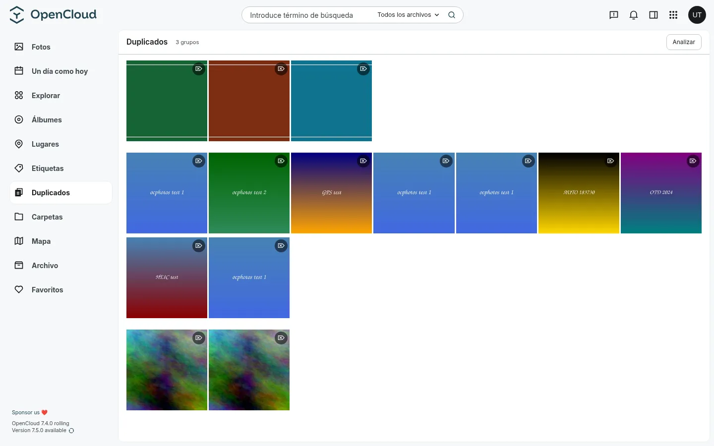 | 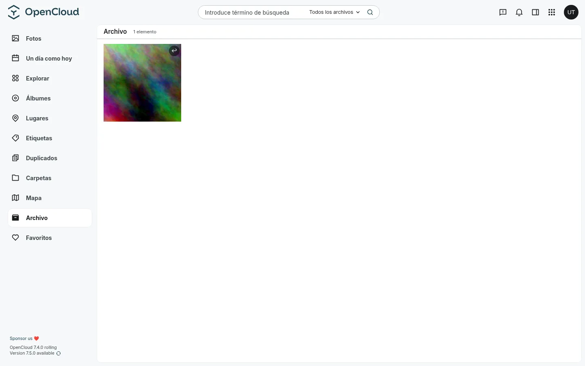 |

| Favorites | Viewer |
|---|---|
| 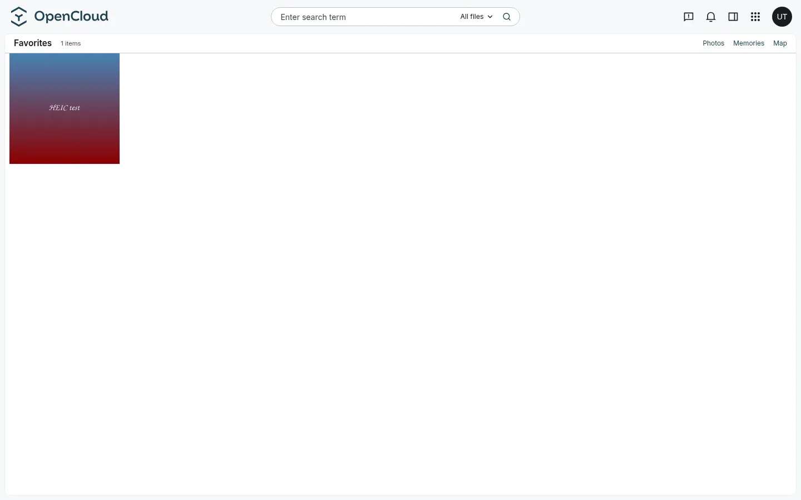 | 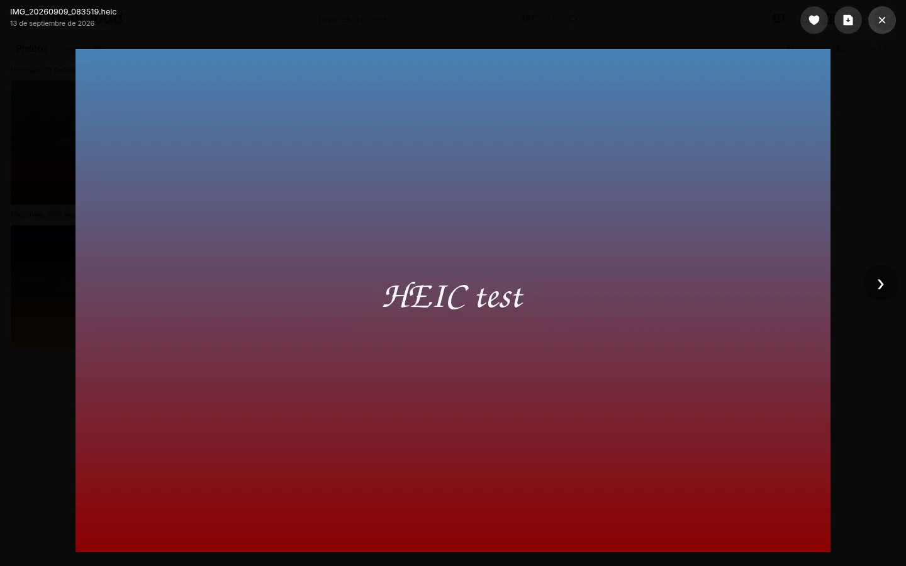 |

## Features

- **Timeline** grouped by month and day, with EXIF capture dates, a justified layout
  (fixed-height rows, widths by aspect ratio), infinite scroll and **Rewind** (year/month
  scrubber to jump to any date).
- **On this day**: highlights strip with "N years ago" cards; falls back to the same month of
  previous years, then to the oldest photos, so it is never empty.
- **Explore**: hub with metadata search (file, camera, path) and quick links.
- **Albums**: create, rename, delete, add/remove photos (from the viewer or the grid).
- **Places**: GPS photos clustered by area (~1 km) with **reverse geocoding** (Nominatim,
  cached in SQLite).
- **Tags**: manual tags, added from the viewer; tag list with counts.
- **Folders**: browse the real OpenCloud folder tree (derived from the index) with breadcrumbs.
- **Map**: photo **thumbnail markers** with count badges, grouped by place; click opens the photos.
- **Duplicates**: perceptual hashes (dHash) to find near-identical photos.
- **Archive**: hide photos from the timeline and keep them in their own view.
- **Videos**: posters generated with ffmpeg (the timeline shows a real frame) and playback
  via a **signed same-origin URL with HTTP Range** streaming. (HLS transcoding is implemented
  in the service but the host CSP blocks `blob:`, so progressive playback is used instead.)
- **Favorites**, **auto-sync** (new photos show up on their own) and **HEIC/HEIF** support
  (pure-Go decoder in the service).
- **Native navigation**: the sections live in OpenCloud's left sidebar (`navItems`), and the
  UI is translated to Spanish (`l10n/translations.json`, follows the host language).

## Architecture

```
OpenCloud (source of truth: files in the personal space)
   |  WebDAV + Graph + OIDC session
   v
photos-service (Go, SQLite)  ──  index (EXIF, GPS, tags, albums, pHash), thumbnails, REST API
   ^  /ocphotos-api/ (same origin, Nginx Proxy Manager)
   |
ocphotos extension (Vue 3)  ──  timeline, on this day, explore, albums, places, tags,
                                folders, map, duplicates, archive, favorites, viewer
```

The extension never stores credentials: it calls the service with the host session bearer,
and the service validates it against OpenCloud's Graph `/me` (single-tenant: only its own user).

## Layout

| Path | What it is |
|---|---|
| `plan.md` | Short plan for the feasibility analysis |
| `analisis-fotos-opencloud.md` / `.docx` | Full feasibility study (Spanish) |
| `ocphotos/` | Native OpenCloud web extension (Vue 3 + extension-sdk) |
| `app/` | Standalone PWA prototype (React 19 + Vite + Tailwind + shadcn/ui) |
| `app/server-go/` | Go photo service: DAV/Graph client, index, EXIF, thumbnails, pHash, geocoding, REST API |
| `deploy/` | Deployment notes for cloud.example.com |

## Development

```bash
# native extension
cd ocphotos
pnpm install
pnpm build        # pnpm build:w to watch
pnpm check:types

# Go service
cd app/server-go
go test ./...
go build ./cmd/photos-service
```

## License

GNU Affero General Public License v3.0 (AGPL-3.0-only). See [LICENSE](LICENSE).
